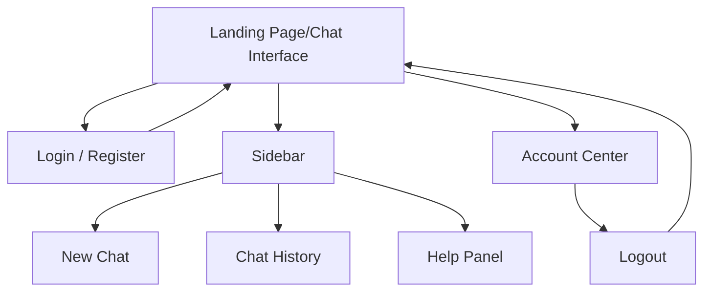

# Iteration 1 report - Group 15
## 1. Role Assignment of each team member
| Member         | Role         |
| -------------- | ------------ |
| Yiwen Cai      | Requirements |
| Shivraj Nath   | Development  |
| Zohaib Ahmed   | Testing      |
| Muhammad Nazir | Testing      |

## 2. GitHub Repo Link, please make the repo public
[https://github.com/ShivrajN727/meka](https://github.com/ShivrajN727/meka)

The repository is public and contains the source code and documentation for Iteration 1.

## 3.User Stories and Features – 20%
| # | User Story | Function | Points Assigned |
|---|------------|----------|-----------------|
| A | As a visitor, I want to see a landing page that explains the tool, so I can understand the application | Home Page | 2 |
| B | As a new user, I want to create an account, so I can access the interface | Account Creation | 3 | 
| C | As a registered user, I want to login to my preexisting account, so that I can access the interface | Log-In | 3 |
| D | As a logged-in user, I want to be able to log out, so that my session is securely ended | Log-Out | 1 | 

Total effort: 2 + 3 + 3 + 1 = 9 points.  
These stories deliver a basic interface with a landing page and user authentication.

## 4. UI Design – 10%
### Pages in the System

  
*Figure 1: UI Wireframe sketch and its UI component.*  
The system contains a single main interface that functions as both the landing page and the chat interface (dashboard).
The page includes several UI components that support user interaction.
The system contains a **single main interface** that functions as both the landing page and the chat interface (dashboard).  
This interface is composed of several UI components that support user interaction.

**UI Components**

1. Conversation sidebar  
2. Chat window  
3. Prompt input panel  
4. Authentication panel (login/logout)  
5. Account center
   
### Page interaction flow


## 5. Unit Tests and Acceptance Tests – 30%
### a. Document the procedure of deriving acceptance tests from use cases and scenarios (using Cucumber.js)


### b. Document how test suites and individual tests are designed (using Jasmine)
Unit tests are written for several UI components including AccountIcon, AuthModal, FlyoutPanel, and Greeting.


### c. Document how each use case/scenario is implemented via completion of a series of unit tests
| Use Case                    | Test File            | Description                                                        |
| --------------------------- | -------------------- | ------------------------------------------------------------------ |
| Display greeting message    | Greeting.spec.cjs    | Tests if the greeting displays the correct user name          |
| Account login/logout button | AccountIcon.spec.cjs | Tests whether the correct button appears depending on login status |
| User authentication         | AuthModal.spec.cjs   | Tests login and registration behavior including API requests       |
| Flyout panel interaction    | FlyoutPanel.spec.cjs | Tests opening, closing, and basic user interactions with the panel        |

### d. You can point to the test cases in the code repository or paste test code in the
document.
spec/components/  
   AccountIcon.spec.cjs  
   AuthModal.spec.cjs  
   FlyoutPanel.spec.cjs  
   Greeting.spec.cjs  

## 6. Software Architecture and Implementation – 30%  
### a. REST API Design  
| Method | Endpoint      | Description                    |
| ------ | ------------- | ------------------------------ |
| POST   | /api/register | Registers a new user account   |
| POST   | /api/login    | Authenticates an existing user |

### b. Routing Table  
| Route | Component | Description                  |
| ----- | --------- | ---------------------------- |
| /     | Landing   | Main interface of the system |

### c. Database Design  
| Field      | Type     | Description                            |
| ---------- | -------- | -------------------------------------- |
| id         | INTEGER  | Primary key for each user              |
| username   | TEXT     | Unique username used for login         |
| password   | TEXT     | Hashed password stored using bcrypt    |
| created_at | DATETIME | Timestamp when the account was created |

```sql
CREATE TABLE users (
  id INTEGER PRIMARY KEY AUTOINCREMENT,
  username TEXT UNIQUE NOT NULL,
  password TEXT NOT NULL,
  created_at DATETIME DEFAULT CURRENT_TIMESTAMP
);
```


