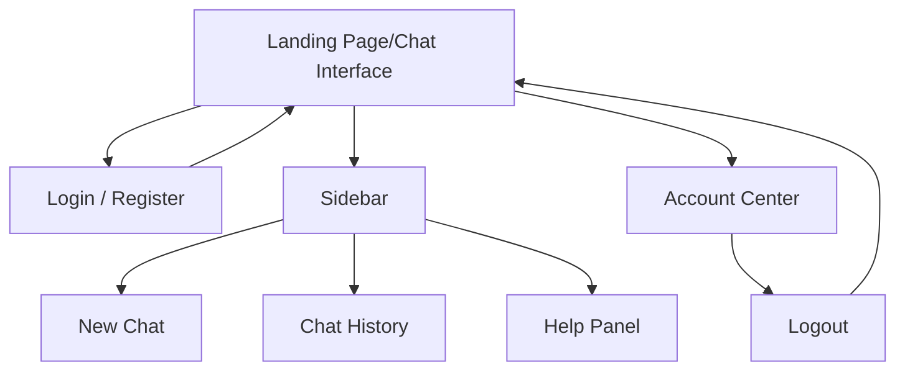

# Iteration 1 report 
## 1. Role Assignment of each team member
| Member         | Role         |
| -------------- | ------------ |
| Yiwen Cai      | Requirements |
| Shivraj Nath   | Development  |
| Zohaib Ahmed   | Testing      |
| Muhammad Nazir | Testing      |

## 2. GitHub Repo Link, please make the repo public
[Github Repository](https://github.com/ShivrajN727/meka)

The repository is public and contains the source code and documentation for Iteration 1.

## 3.User Stories and Features – 20%
| # | User Story | Function | Points Assigned |
|---|------------|----------|-----------------|
| A | As a visitor, I want to see a landing page that explains the tool, so I can understand the application | Home Page | 2 |
| B | As a new user, I want to create an account, so I can access the interface | Account Creation | 3 | 
| C | As a registered user, I want to login to my preexisting account, so that I can access the interface | Log-In | 3 |
| D | As a logged-in user, I want to be able to log out, so that my session is securely ended | Log-Out | 1 | 

Total effort: 2 + 3 + 3 + 1 = 9 points.  
These stories deliver a basic interface with a landing page and user authentication.

## 4. UI Design – 10%
### Pages in the System
The system contains only one page and several UI componets:
- Landing Page/Chat Interface(Dashboard Page)
- UI components  
   1.Conversation side bar  
   2.Chat window  
   3.Prompt input panel  
   4.Authentication panel(login/ logout)  
   5.Account Center  
  
*Figure 1: UI Wireframe sketch.

### Page interaction flow

## 5. Unit Tests and Acceptance Tests – 30%
a. Document the procedure of deriving acceptance tests from use cases and
scenarios (using Cucumber.js)

b. Document how test suites and individual tests are designed (using Jasmine)

c. Document how each use case/scenario is implemented via completion of a series
of unit tests
d. You can point to the test cases in the code repository or paste test code in the
document.

